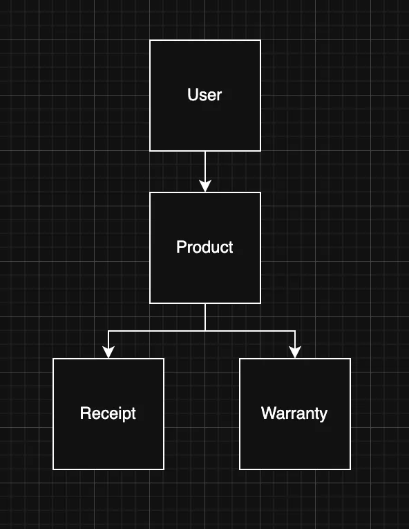

## Week One

## The Idea
As mentioned in the introduction, on the third semester we had to personally choose a project to work on in Java backend where we have to implement the use of **Hibernate and JPA**. With that being said, the idea stems from my lack of tracking warranties and just plainly being lazy as one might say.

**Progress:**

My progress throughout the blog will mainly be written in a bullet poitnt form to make it easy and simple to understand where I'm at, and perhaps every once in a while I'll add a few images so that it's easier to visualize.

- Wrote a document with what I would need for the project to work.
- Figured out which Entities I needed for my project **(User, Product, Warranty, Receipt)**.
- Created Intellij-project, used a template we made in class with hibernate already implemented.
- Created a repository on github and connected it to my intellij project.
- Created portfolio repository and worked on learning markdown in Visual Studio Code.
- After feedback from my teacher I constructed a **Domain Model** and a **Class Diagram** which looks as follows:

**Reasoning:**

- Keep my **Entities** simple. **User** has a **product, warrant and receipt**.
- The fields were filled as placeholders for the time being.
- Most of my focus was on the portfolio **(Markdown)** to set it all up.