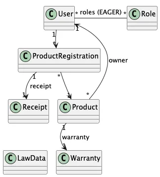
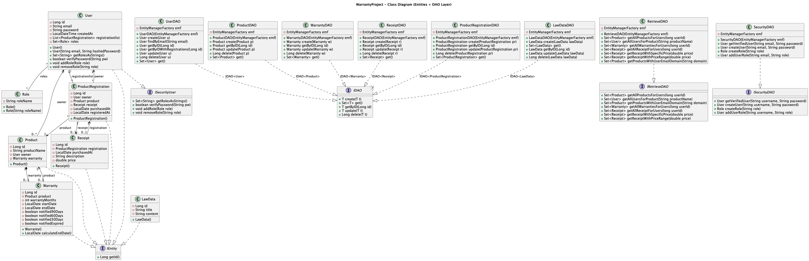

## JPA - JPQL - DAO

The goal of this phase was to make the persistence layer reflect the real domain: users, register, products.
 Registrations may have receipts, and products have warranties. I implemented JPA mappings between `User`, `Product`, `ProductRegistration`, `Receipt`, and `Warranty`, then built a DAO layer that standardizes CRUD operations through `IDAO<T>` and uses JPQL for queries that traverse relationships (implemented in `RetrieveDAO` and selected methods in `UserDAO`/`SecurityDAO`).

<div class="row-image">
<div class="image-center">

</div>

A key focus was avoiding overly complex objects: data are handled explicitly (for example with `JOIN FETCH` when needed), and delete behavior is handled deliberately to avoid unintended cascades.

```java
public User getByIDWithRegistrations(Long id) {
    try (EntityManager em = emf.createEntityManager()) {
        try {
            return em.createQuery(
                "SELECT DISTINCT u FROM User u " +
                "LEFT JOIN FETCH u.registrationlist " +
                "WHERE u.id = :id",
                        User.class)
                        .setParameter("id", id)
                        .getSingleResult();
        } catch (NoResultException e) {
            throw new EntityNotFoundException("No entity found with id: " + id);
        }
    }
}
```

Issues related to retrieving users with or without a registrationlist caused `LazyInitializationException` when trying to retrieve users with a registrationlist, using `LEFT JOIN FETCH` ensures that a user is still returned even if the specific user has no registrationlist.

## What

Implemented the persistence layer using JPA by defining the entities `User`, `Product`, `ProductRegistration`, `Receipt`, and `Warranty`, along with their relationships. A DAO structure was introduced through `IDAO<T>`, with concrete implementations such as `RetrieveDAO`, `UserDAO`, and `SecurityDAO`.

<div class="row-image">
<div class="image-center">

</div>

Custom JPQL queries were added to handle relational data, including `getByIDWithRegistrations(Long id)`, which uses `LEFT JOIN FETCH` to retrieve a `User` together with its `registrationlist`.

## Why

The main problem was ensuring reliable retrieval of related data without encountering `LazyInitializationException`, while keeping the domain model simple and maintainable. There was also a need to avoid excessive cascading and unintended side effects in persistence operations.

Constraints included maintaining clear entity relationships, ensuring predictable data access for API use, and supporting testability without overly complex configurations.

## Design reasoning (tradeoffs)

| Aspect                | Description                                                                                                                                        |
| --------------------- | -------------------------------------------------------------------------------------------------------------------------------------------------- |
| **Choice**            | Use explicit JPQL queries with `JOIN FETCH` for controlled loading of relationships                                                                |
| **Alternative(s)**    | Default fetch types (`EAGER` / `LAZY`) and cascading strategies                                                                                    |
| **Not chosen**    | Default strategies can cause inefficient queries or `LazyInitializationException`, while cascading may introduce unintended persistence operations |
| **Risks  downsides** | More verbose queries and tighter coupling between query logic and entities                                                                         |
| **Mitigations**       | Centralize query logic in DAO classes and reuse methods for consistency                                                                            |
| **Next step**         | Introduce DTOs to handle larger datasets and improve performance                                                                     |