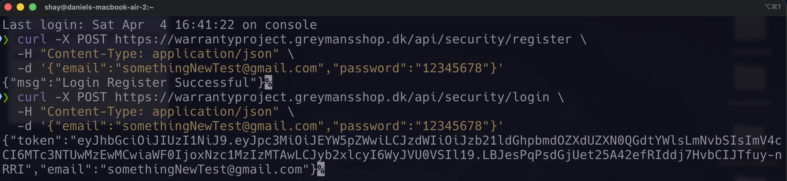
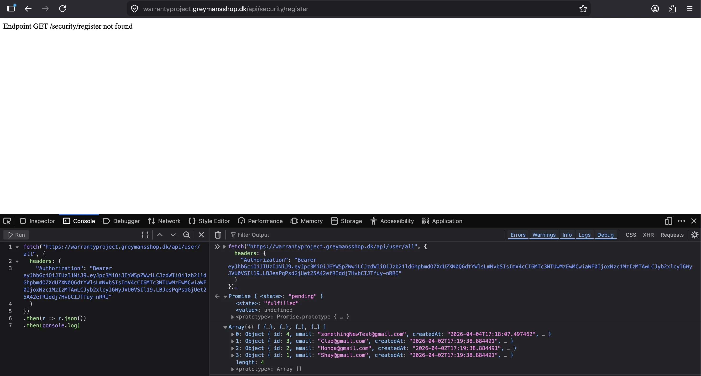

## Requests & Tests

Implemented RESTful endpoints for the application using Javalin, covering user and security operations such as `/security/register`, `/security/login`, `/user/all`, and `/user/{id}`. Requests are tested using an HTTP client setup (`http-client.env.json`) to support both local and deployed environments, with JWT tokens included in the `Authorization` header for protected routes.

Integration tests were implemented using JUnit and RestAssured. A containerized PostgreSQL database (Testcontainers) is used to run tests in an isolated environment. Tests cover authentication, endpoint protection, and validation, including scenarios such as successful login, unauthorized access, and invalid input handling.

>The image demonstrates manual testing of the REST API using `curl`, performed due to the absence of a frontend. A user is registered and then logs in to be authenticated, after which a JWT token is returned and used to authorize access to protected endpoints.

>The image shows testing of a protected REST endpoint using the browser’s developer console. A `fetch` request is sent to `/user/all` with a JWT token included in the `Authorization` header. The successful response demonstrates that authentication is working and that access to protected resources is granted when a valid token is provided.

## Why

The goal was to expose application functionality through a REST API and ensure it behaves correctly under different scenarios. REST endpoints allow structured communication between client and backend, while testing ensures reliability and prevents regressions. Constraints included maintaining stateless authentication using JWT, ensuring endpoints are properly secured, and running tests in an environment that closely resembles production.

## Design reasoning (tradeoffs)

| Aspect                | Description                                                                                                                                                           |
| --------------------- | --------------------------------------------------------------------------------------------------------------------------------------------------------------------- |
| **Choice**            | Use REST principles with Javalin, JWT for securing endpoints, and integration testing with JUnit + RestAssured + Testcontainers                                       |
| **Alternative(s)**    | Manual testing only, in-memory database testing, or session-based authentication                                                                                      |
| **Not chosen**    | Manual testing is unreliable and not repeatable; in-memory databases do not reflect real database behavior; session-based authentication breaks REST stateless design |
| **Risks downsides** | Increased setup complexity for tests (containers, ports); slower test execution due to real database usage                                                            |
| **Mitigations**       | Use Testcontainers for consistent environments, dynamic ports to avoid conflicts, and automated test setup/teardown to ensure isolation                               |